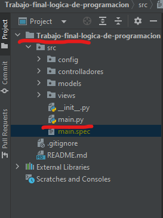

# Trabajo final Logica de programacion

Para tener en ejecucion local debe tener instalado
- Correr el archivo main desde Pycharm

- PyQt5
- sqlite3
- Se debe arrastrar la carpeta trabajo-final-logica para poder ejecutar el archivo main dentro de PyCharm

# Estudiantes
- Brayan Obilmer Vallejos Mueses
- Carlos Mario Navarro Ruz
- Juan Fernando Giraldo Mora
